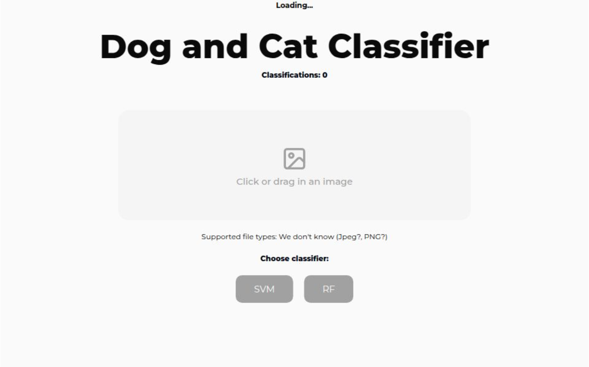

# Image Classification: Cats vs Dogs


[](https://tnm119-dog-cat-classifier.vercel.app)

## Important

The frontend was not the focus of this project..... as you can see, soooooo sorry for the spaghetti code.

## Project Overview

This project classifies images of cats and dogs using machine learning. It uses a trained model to predict whether an uploaded image contains a cat or a dog.

You can try the live version of the app:
[](https://tnm119-dog-cat-classifier.vercel.app/)

## Features

- Upload an image to classify it as a cat or dog 🐱🐶
- Uses a pre-trained machine learning model for accurate predictions
- Built with **Python (Flask)** and **Next.js** for backend and frontend
- Provides instant results after image upload

## Concept explanation

- You can go through the Google presentation [here](https://docs.google.com/presentation/d/1eR0hhPlOI0-lmUgL10Bwnllc52NzgC9QJZtCSwUivec/edit?usp=sharing)

## Installation

1. **Clone the repository**:

   ```bash
   git clone https://github.com/AntonMartic/ml-model-for-image-classification.git
   ```

2. **Navigate to the project directory**:

   ```bash
   cd ml-model-for-image-classification
   ```

3. **Set up a virtual environment**:

   ```bash
   cd server
   python -m venv venv
   source venv/bin/activate  # Windows: venv\Scripts\activate
   ```

4. **Install Python dependencies**:

   ```bash
   pip install -r requirements.txt
   ```

5. **Install frontend dependencies**:

   ```bash
   npm install
   ```

6. **Run the Flask backend**:

   ```bash
   cd server
   python server.py # Windows: py server.py
   ```

   The backend will be available at http://127.0.0.1:8080

7. **Start the Next.js frontend**:

   ```bash
   npm run dev
   ```

   The frontend will be available at http://localhost:3000

8. **Upload an image and classify it!**

## License

This project is licensed under the **MIT License**.  
See the [LICENSE](LICENSE) file for more details.
